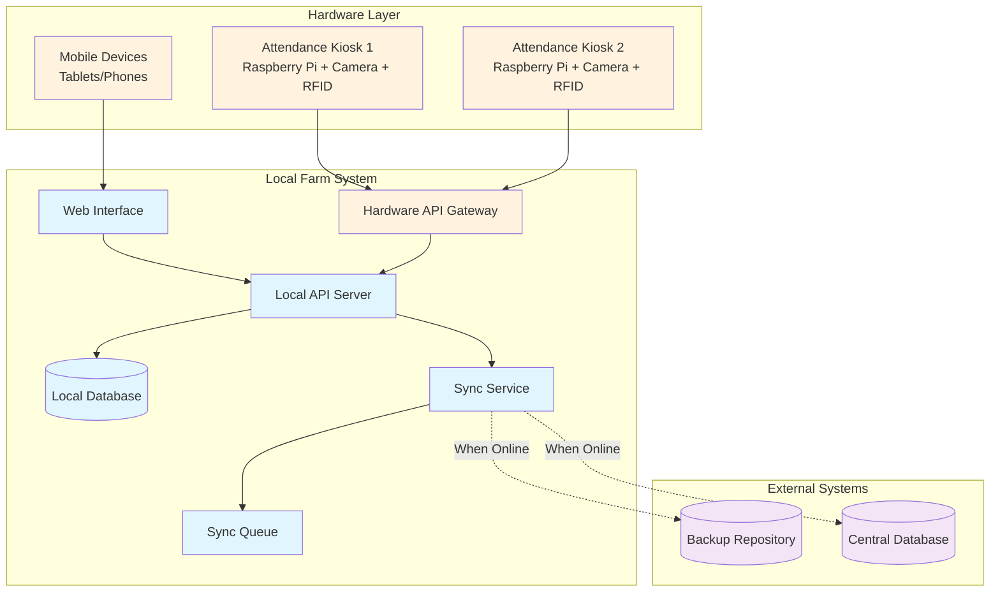

# Farm Attendance System Design Document

## Overview

The Farm Attendance System is designed as an offline-first web application that provides reliable employee time tracking for agricultural operations. The system uses a local-first architecture with eventual consistency synchronization to ensure uninterrupted operation regardless of network connectivity.

### Key Design Principles
- **Offline-First**: Core functionality works without internet connectivity
- **Eventual Consistency**: Data synchronizes when connectivity is available
- **Local Authority**: Local system is authoritative for real-time operations
- **Audit Trail**: All changes are logged with timestamps and user attribution
- **Progressive Enhancement**: Enhanced features when online, core features always available

## Architecture

### System Architecture Overview



### Technology Stack
- **Frontend**: React Progressive Web App (PWA) with service workers for offline capabilities
- **Backend**: Node.js/Express API server
- **Database**: SQLite for local storage (reliable, file-based, no server required)
- **Sync**: Custom sync service with conflict resolution
- **Authentication**: Local JWT-based authentication with biometric/card support
- **State Management**: Redux Toolkit with RTK Query for offline-first data management
- **Hardware**: Raspberry Pi-based attendance kiosks with camera and card reader integration

## Hardware Components

### Attendance Kiosks (Raspberry Pi-based)
**Purpose**: Dedicated hardware stations for employee clock in/out

**Hardware Specifications**:
- **Main Unit**: Raspberry Pi 4 (4GB RAM minimum)
- **Display**: 7-10 inch touchscreen display
- **Camera**: USB camera for facial recognition/photo capture
- **RFID Reader**: 125kHz/13.56MHz RFID card reader
- **Network**: Ethernet + WiFi for redundancy
- **Storage**: 32GB+ SD card with wear leveling
- **Power**: PoE or 12V power supply with UPS backup
- **Enclosure**: Weatherproof IP65 rated for outdoor use

**Software Stack**:
- **OS**: Raspberry Pi OS Lite
- **Runtime**: Node.js for local processing
- **Display**: Chromium in kiosk mode displaying React PWA
- **Camera Service**: OpenCV for image processing
- **RFID Service**: Custom driver for card reading

**Key Features**:
- Offline operation with local data storage
- Automatic employee recognition via RFID cards
- Photo capture for attendance verification
- Visual and audio feedback for successful clock in/out
- Automatic sync with central server when network available
- Tamper detection and security alerts

### Hardware Integration Architecture

```typescript
interface HardwareKiosk {
  // RFID card reading
  readRFIDCard(): Promise<string>
  
  // Camera operations
  capturePhoto(): Promise<Buffer>
  enableFaceRecognition(): Promise<boolean>
  
  // Display and user interaction
  showMessage(message: string, type: 'success' | 'error' | 'info'): void
  playSound(soundType: 'success' | 'error' | 'beep'): void
  
  // Network and sync
  checkConnectivity(): Promise<boolean>
  syncWithServer(): Promise<SyncResult>
  
  // System health
  getSystemStatus(): SystemHealth
  reportTamperAttempt(): void
}
```

### Mobile/Tablet Support
- **Supervisor Tablets**: For managers to access full interface
- **Employee Mobile**: Personal devices for viewing schedules/history
- **Backup Access**: Mobile browser access when kiosks unavailable

## Components and Interfaces

### 1. Employee Interface
**Purpose**: Allow employees to clock in/out and view their attendance

**Key Features**:
- Simple clock in/out buttons with timestamp display
- Current shift status and elapsed time
- Personal attendance history (last 30 days)
- Offline status indicator

**Interface Design**:
```typescript
interface EmployeeInterface {
  clockIn(employeeId: string): Promise<AttendanceRecord>
  clockOut(employeeId: string): Promise<AttendanceRecord>
  getCurrentShift(employeeId: string): Promise<ShiftStatus | null>
  getAttendanceHistory(employeeId: string, days: number): Promise<AttendanceRecord[]>
}
```

### 2. Manager Interface
**Purpose**: Oversee daily operations and manage employee attendance

**Key Features**:
- Real-time dashboard showing all employee status
- Daily/weekly/monthly attendance reports
- Manual time entry corrections with audit trails
- Employee performance metrics
- Attendance alerts and notifications

**Interface Design**:
```typescript
interface ManagerInterface {
  getDashboard(date: Date): Promise<DashboardData>
  getAttendanceReport(startDate: Date, endDate: Date): Promise<AttendanceReport>
  adjustTimeEntry(recordId: string, adjustment: TimeAdjustment): Promise<void>
  getEmployeeMetrics(employeeId: string, period: DateRange): Promise<EmployeeMetrics>
}
```

### 3. Admin Interface
**Purpose**: System configuration and employee management

**Key Features**:
- Employee CRUD operations
- Time category configuration (thresholds, pay rates)
- System settings and sync configuration
- User role management
- System health monitoring

**Interface Design**:
```typescript
interface AdminInterface {
  manageEmployees(): EmployeeManagement
  configureTimeCategories(): TimeCategoryConfig
  manageSystemSettings(): SystemSettings
  viewSyncStatus(): SyncStatus
  generateSystemReports(): SystemReports
}
```

### 4. Sync Service
**Purpose**: Handle data synchronization with external systems

**Key Features**:
- Automatic sync when connectivity detected
- Conflict resolution with manual override options
- Incremental sync to minimize data transfer
- Retry logic with exponential backoff
- Sync status reporting

**Interface Design**:
```typescript
interface SyncService {
  detectConnectivity(): Promise<boolean>
  syncToExternal(): Promise<SyncResult>
  resolveConflicts(conflicts: DataConflict[]): Promise<void>
  getLastSyncStatus(): SyncStatus
  forceSyncNow(): Promise<SyncResult>
}
```

## Data Models

### Core Entities

```typescript
interface Employee {
  id: string
  employeeNumber: string
  firstName: string
  lastName: string
  email?: string
  role: 'employee' | 'manager' | 'admin'
  isActive: boolean
  createdAt: Date
  updatedAt: Date
  lastSyncAt?: Date
}

interface AttendanceRecord {
  id: string
  employeeId: string
  clockInTime: Date
  clockOutTime?: Date
  totalHours?: number
  timeCategory?: string
  notes?: string
  adjustments: TimeAdjustment[]
  createdAt: Date
  updatedAt: Date
  syncStatus: 'pending' | 'synced' | 'conflict'
}

interface TimeCategory {
  id: string
  name: string
  minHours: number
  maxHours?: number
  payMultiplier: number
  color: string
  isActive: boolean
  createdAt: Date
  updatedAt: Date
}

interface TimeAdjustment {
  id: string
  recordId: string
  adjustedBy: string
  originalValue: any
  newValue: any
  reason: string
  timestamp: Date
}

interface SyncQueue {
  id: string
  operation: 'create' | 'update' | 'delete'
  entityType: string
  entityId: string
  data: any
  attempts: number
  lastAttempt?: Date
  status: 'pending' | 'processing' | 'completed' | 'failed'
  createdAt: Date
}
```

### Database Schema Design

The system uses SQLite with the following key tables:
- `employees` - Employee master data
- `attendance_records` - Time tracking entries
- `time_categories` - Configurable work classifications
- `time_adjustments` - Audit trail for manual corrections
- `sync_queue` - Pending synchronization operations
- `system_settings` - Configuration parameters
- `sync_log` - Synchronization history and status

## Error Handling

### Offline Operation Errors
- **Database Connection Issues**: Graceful degradation with user notification
- **Storage Full**: Alert admin and provide cleanup options
- **Clock Synchronization**: Use local time with sync correction when online

### Sync Operation Errors
- **Network Timeouts**: Retry with exponential backoff (1s, 2s, 4s, 8s, 16s)
- **Data Conflicts**: Present resolution interface to managers/admins
- **Authentication Failures**: Re-authenticate and retry
- **Partial Sync Failures**: Continue with successful operations, queue failed items

### User Interface Errors
- **Invalid Time Entries**: Client-side validation with clear error messages
- **Permission Denied**: Redirect to appropriate interface level
- **Session Timeout**: Automatic re-authentication for active users

### Error Recovery Strategies
```typescript
interface ErrorRecovery {
  retryWithBackoff(operation: () => Promise<any>, maxRetries: number): Promise<any>
  handleDataConflict(local: any, remote: any): Promise<any>
  gracefulDegradation(feature: string): void
  notifyUser(error: AppError): void
}
```

## Testing Strategy

### Unit Testing
- **Data Models**: Validation, calculations, and business logic
- **Sync Service**: Conflict resolution and retry mechanisms
- **Time Calculations**: Category assignment and hour calculations
- **Authentication**: Role-based access control

### Integration Testing
- **Database Operations**: CRUD operations and data integrity
- **API Endpoints**: Request/response handling and error cases
- **Sync Workflows**: End-to-end synchronization scenarios
- **Offline Scenarios**: Functionality without network connectivity

### End-to-End Testing
- **Employee Workflows**: Complete clock in/out cycles
- **Manager Operations**: Report generation and time adjustments
- **Admin Functions**: Employee management and system configuration
- **Sync Scenarios**: Online/offline transitions and data consistency

### Performance Testing
- **Database Performance**: Query optimization for large datasets
- **Sync Performance**: Large data synchronization scenarios
- **UI Responsiveness**: Interface performance under load
- **Storage Efficiency**: Database growth and cleanup strategies

### Testing Tools and Framework
```typescript
// Example test structure
describe('AttendanceService', () => {
  describe('clockIn', () => {
    it('should record clock in time when employee is not already clocked in')
    it('should prevent duplicate clock in for same employee')
    it('should work offline and queue for sync')
  })
  
  describe('calculateTimeCategory', () => {
    it('should assign correct category based on hours worked')
    it('should handle edge cases at category boundaries')
    it('should respect custom category configurations')
  })
})
```

### Offline Testing Strategy
- **Network Simulation**: Test with various connectivity scenarios
- **Data Persistence**: Verify local data survives application restarts
- **Sync Recovery**: Test sync after extended offline periods
- **Conflict Resolution**: Simulate and test various conflict scenarios